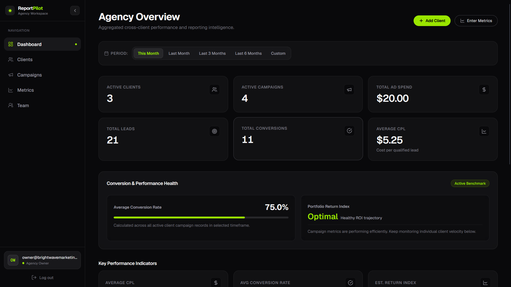
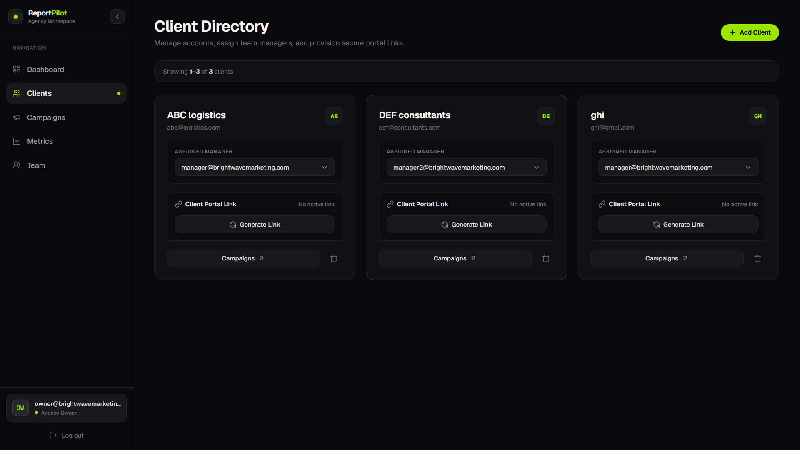
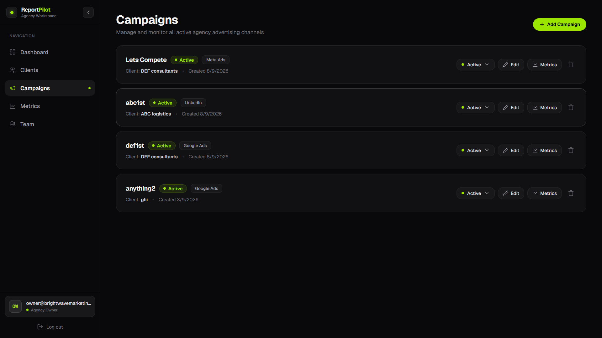
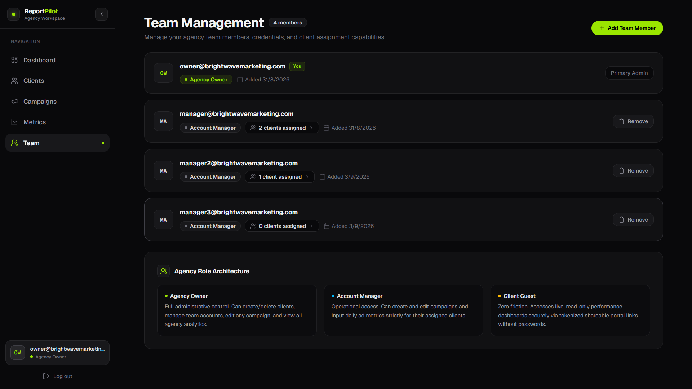

# ReportPilot

A multi-tenant marketing analytics and reporting platform for digital agencies to track ad campaigns, monitor performance metrics, manage team permissions, and share token-secured client portals.

---

## Overview

Digital agencies managing marketing across multiple clients often struggle with fragmented reporting, manual spreadsheet updates, and insecure ways of sharing performance data.

**ReportPilot** solves this by providing:
- A centralized agency dashboard to aggregate spend, leads, and conversions across ad platforms (Google Ads, Meta Ads, and custom channels).
- Role-based team access so account managers only see clients explicitly assigned to them.
- A public, read-only **Client Portal** that agencies can share with clients via time-limited, cryptographic link tokens—without forcing clients to create an account or log in.

---

## Landing Page


Public-facing marketing page detailing ReportPilot's cross-channel analytics, automated client portal links, and role-based agency management features.

---

## Login Page


Agency authentication screen supporting secure HMAC-SHA256 JWT sessions and rate-limited credential submissions.

---

## Dashboard



Centralized agency overview displaying aggregate ad spend, total leads, conversions, average CPL, and performance health metrics across all active accounts.

---

## Clients



Client directory allowing agency administrators to manage client accounts, assign dedicated account managers, and provision instant, token-protected portal links.

---

## Campaign



Campaign dashboard for monitoring multi-channel ad initiatives across Google Ads, Meta Ads, and custom advertising platforms with real-time status toggles.

---

## Teams



Team management portal for agency owners to invite account managers, configure account permissions, and assign client portfolios.

---

## Features

### 1. Agency & Multi-Tenant Management
- Multi-tenant data isolation: Each agency operates in its own isolated workspace.
- High-level agency summary dashboard: Aggregate ad spend, leads generated, conversions, average Cost Per Lead (CPL), and average Conversion Rate (CVR).
- Interactive filtering by date range (This Month, Last Month, Last 30 Days, Last 90 Days, Custom Range) and client filter.

### 2. Client & Campaign Tracking
- Full CRUD management for agency clients with contact details.
- Campaign tracking per client, categorized by marketing platform (`google_ads`, `meta_ads`, `other`) and status (`active`, `paused`, `completed`).
- Direct navigation between clients, campaigns, and historical metrics.

### 3. Metric Recording & Performance Analytics
- Record periodic metric entries per campaign (reporting period, ad spend, impressions, clicks, leads, conversions).
- Automatic server-side computation of key performance indicators:
  - **Cost Per Lead (CPL)**: $\text{Ad Spend} \div \text{Leads}$
  - **Conversion Rate (CVR)**: $(\text{Conversions} \div \text{Clicks}) \times 100$
- Visual data trends using responsive line and bar charts (powered by Recharts).

### 4. Shareable Client Portal (Read-Only)
- Generate revocable, time-limited portal links for any client (`/portal/[token]`).
- Clients view a clean, read-only dashboard displaying their specific campaign performance and KPI summaries.
- Production-ready URL resolution supporting local development, Vercel deployments (`.vercel.app`), and custom production domains.

### 5. Role-Based Access Control (RBAC)
- **Agency Owner**: Full access to all agency clients, campaigns, metrics, team management, and client assignments.
- **Account Manager**: Restricted access limited strictly to clients assigned to them by an Owner. Cannot view or modify unassigned clients or team settings.

### 6. Built-in Security & Rate Limiting
- In-memory rate limiting with sliding reset windows across sensitive endpoints (login, registration, portal views, team actions).
- Timing-safe cryptographic comparisons and SHA-256 token hashing.
- Strict input validation on IDs, dates, pagination, and payload structures.

---

## Tech Stack

| Layer | Technologies |
| :--- | :--- |
| **Frontend** | [Next.js 16](https://nextjs.org/) (App Router, Turbopack), [React 19](https://react.dev/), [TypeScript](https://www.typescriptlang.org/) |
| **Styling & UI** | [Tailwind CSS v4](https://tailwindcss.com/), [Framer Motion](https://www.framer.com/motion/), [Recharts](https://recharts.org/), [clsx](https://github.com/lukeed/clsx), [tailwind-merge](https://github.com/dcastil/tailwind-merge) |
| **Backend / API** | Next.js API Routes (`app/api/*`), Node.js `crypto` |
| **Database** | [Supabase](https://supabase.com/) ([PostgreSQL](https://www.postgresql.org/)) |
| **Authentication** | Custom HMAC-SHA256 JWT tokens, SHA-256 password hashing with secret salt, React Auth Context |
| **Storage** | Relational data stored in PostgreSQL (no external object/blob storage used) |
| **Deployment** | [Vercel](https://vercel.com/) |

---

## Architecture

```text
┌─────────────────────────────────────────────────────────────┐
│                       Next.js Frontend                      │
│   Landing Page  •  Auth Pages  •  Dashboard  •  Client Portal│
└──────────────┬───────────────────────────────┬──────────────┘
               │ (Authenticated API Requests)  │ (Public Token Fetch)
               ▼                               ▼
┌─────────────────────────────────────────────────────────────┐
│                 Next.js Backend API Routes                  │
│  ┌───────────────────────┐       ┌────────────────────────┐ │
│  │   Auth Middleware     │       │  In-Memory Rate Limit  │ │
│  │  (JWT + Role Check)   │       │ (IP / Account / Token) │ │
│  └───────────┬───────────┘       └───────────┬────────────┘ │
│              │                               │              │
│              ▼                               ▼              │
│  ┌────────────────────────────────────────────────────────┐ │
│  │  Controllers & Validation (lib/utils/validation.ts)    │ │
│  └───────────────────────────┬────────────────────────────┘ │
└──────────────────────────────┼──────────────────────────────┘
                               │ (Service Role Client)
                               ▼
┌─────────────────────────────────────────────────────────────┐
│                 Supabase (PostgreSQL Database)              │
│  agencies • users • clients • campaigns • metric_entries   │
│       user_client_assignments • client_access_tokens       │
└─────────────────────────────────────────────────────────────┘
```

1. **Client-Side Runtime**: React components fetch data through standard `fetch` wrappers (`apiFetch`) that attach Bearer tokens stored in `localStorage`.
2. **Server-Side API Routes**: Requests pass through route protection (`protectedRoute`), validating JWT signatures, checking roles (`checkRole`), and enforcing rate limits.
3. **Database Queries**: The backend uses `@supabase/supabase-js` with the Supabase Service Role Key to perform scoped SQL queries, enforcing tenant boundaries (`agency_id`) at the application layer.

---

## User Flow

1. **Sign Up / Onboarding**:
   - An agency owner signs up with their email, password, and agency name.
   - An `agencies` record is created, and the user is registered as the agency `owner`.
2. **Setup Clients & Campaigns**:
   - The owner adds clients (e.g., Acme Corp).
   - The owner or assigned account manager creates campaigns under each client (e.g., "Google Search - Brand", "Meta Retargeting").
3. **Log Metrics**:
   - Marketing performance data is added for reporting periods (spend, impressions, clicks, leads, conversions).
   - CPL and conversion rates calculate automatically.
4. **Invite Team Members & Assign Clients**:
   - The owner invites account managers from the **Team** tab and assigns specific clients to them.
   - When an account manager logs in, their dashboard and client list only show their assigned accounts.
5. **Share Client Portal**:
   - From the **Clients** list, the agency generates a Client Portal link with an optional expiration date.
   - The agency copies the generated link (`https://.../portal/<token>`) and sends it to the client.
   - The client opens the link and views their live performance metrics without needing an account.

---

## Project Structure

```text
ReportPilot/
├── app/
│   ├── (auth)/                    # Authentication routes
│   │   ├── login/page.tsx         # User login page
│   │   └── signup/page.tsx        # Agency registration page
│   ├── (dashboard)/               # Authenticated application views
│   │   ├── campaigns/page.tsx     # Campaign list, filters, and creation
│   │   ├── clients/page.tsx       # Client management & portal link generator
│   │   ├── dashboard/page.tsx     # Agency aggregate analytics dashboard
│   │   ├── metrics/page.tsx       # Performance metrics logging & view
│   │   └── team/page.tsx          # Team members & client assignments (Owner only)
│   ├── api/                       # Backend REST API routes
│   │   ├── auth/                  # /api/auth/login, /api/auth/signup
│   │   ├── campaigns/             # /api/campaigns & /api/campaigns/[id]
│   │   ├── clients/               # /api/clients, /api/clients/[id], portal-token
│   │   ├── dashboard/             # /api/dashboard/agency, /api/dashboard/client
│   │   ├── metrics/               # /api/metrics & /api/metrics/[id]
│   │   └── team/                  # /api/team, /api/team/[id], assignments
│   ├── portal/
│   │   └── [token]/page.tsx       # Public client portal dashboard
│   ├── globals.css                # Global styles and Tailwind configuration
│   ├── layout.tsx                 # Root HTML structure & AuthProvider wrapper
│   └── page.tsx                   # Public marketing landing page
├── components/
│   ├── charts/                    # Recharts data visualization components
│   ├── common/                    # Modal dialogs, buttons, icons, navbar
│   ├── filters/                   # Date range and client select filters
│   └── layouts/                   # Sidebar, dashboard shell, navigation
├── lib/
│   ├── context/                   # AuthContext and client route guards
│   ├── middleware.ts              # Route-level JWT verification & RBAC helper
│   ├── supabase/                  # Server and client Supabase initializers
│   └── utils/                     # Auth, URL resolver, rate limiting, validations
├── types/
│   └── index.ts                   # TypeScript interfaces, DB models, API types
├── .env.example                   # Environment variable template
├── next.config.ts                 # Next.js configuration
├── package.json                   # Dependencies and npm scripts
└── tsconfig.json                  # TypeScript compiler settings
```

---

## Getting Started

### Prerequisites
- **Node.js**: v18.18.0 or newer (Node 20+ recommended)
- **npm**: v9+ (or pnpm / yarn)
- **Supabase Account**: A Supabase project with database tables initialized

### 1. Clone the Repository
```bash
git clone https://github.com/ShViNaY/ReportPilot.git
cd ReportPilot
```

### 2. Install Dependencies
```bash
npm install
```

### 3. Configure Environment Variables
Copy the example environment file and fill in your Supabase credentials and JWT secret:
```bash
cp .env.example .env.local
```

---

## Environment Variables

The project requires the following environment variables (defined in `.env.local` for local development or in your Vercel project settings):

| Variable | Required | Scope | Description |
| :--- | :---: | :---: | :--- |
| `NEXT_PUBLIC_SUPABASE_URL` | **Yes** | Client & Server | Your Supabase project URL (`https://<project-id>.supabase.co`). |
| `NEXT_PUBLIC_SUPABASE_ANON_KEY` | **Yes** | Client & Server | Supabase anonymous public API key. |
| `SUPABASE_SERVICE_ROLE_KEY` | **Yes** | Server-Only | Supabase service role secret key (used in backend API routes). |
| `JWT_SECRET` | **Yes** | Server-Only | 32+ character random secret used to sign JWT tokens and hash passwords. |
| `NEXT_PUBLIC_APP_URL` | No | Client & Server | Base URL of your deployed app (e.g. `https://app.reportpilot.com`). Automatically defaults to Vercel production URL or `http://localhost:3000`. |
| `RATE_LIMIT_*` | No | Server-Only | Optional threshold overrides for login, registration, portal, and user rate limits. |

---

## Running the Project

### Development Server
Starts the Next.js development server with Turbopack:
```bash
npm run dev
```
Open [http://localhost:3000](http://localhost:3000) in your browser.

### Production Build
Verifies TypeScript types and creates an optimized production build:
```bash
npm run build
```

### Start Production Server
Runs the built production application locally:
```bash
npm run start
```

### Linting
Checks code style and syntax rules using ESLint:
```bash
npm run lint
```

---

## API Reference

All protected routes expect an `Authorization: Bearer <token>` header.

### Authentication
| Method | Endpoint | Access | Description |
| :--- | :--- | :--- | :--- |
| `POST` | `/api/auth/signup` | Public | Register a new agency and owner account. |
| `POST` | `/api/auth/login` | Public | Authenticate user and return JWT + user profile. |

### Dashboard
| Method | Endpoint | Access | Description |
| :--- | :--- | :--- | :--- |
| `GET` | `/api/dashboard/agency` | Authenticated | Aggregate agency analytics (supports `startDate`, `endDate`, `clientId`). |
| `GET` | `/api/dashboard/client` | Public (Token) | Client portal summary and metrics via `?token=<portal_token>`. |

### Clients & Portal Tokens
| Method | Endpoint | Access | Description |
| :--- | :--- | :--- | :--- |
| `GET` | `/api/clients` | Authenticated | List clients (scoped to assigned clients for Account Managers). |
| `POST` | `/api/clients` | Owner only | Create a new client. |
| `GET` | `/api/clients/[id]` | Authenticated | Fetch details for a specific client. |
| `PATCH` | `/api/clients/[id]` | Authenticated | Update client name or contact email. |
| `DELETE` | `/api/clients/[id]` | Owner only | Delete a client and associated data. |
| `GET` | `/api/clients/[id]/portal-token` | Authenticated | Check if client has an active portal token and expiration. |
| `POST` | `/api/clients/[id]/portal-token` | Authenticated | Generate a new portal token and canonical URL. |
| `DELETE` | `/api/clients/[id]/portal-token` | Authenticated | Revoke an existing portal token. |

### Campaigns
| Method | Endpoint | Access | Description |
| :--- | :--- | :--- | :--- |
| `GET` | `/api/campaigns` | Authenticated | List campaigns (supports `client_id` query param). |
| `POST` | `/api/campaigns` | Authenticated | Create a new campaign. |
| `GET` | `/api/campaigns/[id]` | Authenticated | Fetch details for a single campaign. |
| `PATCH` | `/api/campaigns/[id]` | Authenticated | Update campaign name, platform, or status. |
| `DELETE` | `/api/campaigns/[id]` | Authenticated | Delete a campaign. |

### Metrics
| Method | Endpoint | Access | Description |
| :--- | :--- | :--- | :--- |
| `GET` | `/api/metrics` | Authenticated | List metrics (supports `campaign_id`, `client_id`, date filters). |
| `POST` | `/api/metrics` | Authenticated | Log a new metric entry (calculates CPL & CVR). |
| `GET` | `/api/metrics/[id]` | Authenticated | Get a single metric record. |
| `PATCH` | `/api/metrics/[id]` | Authenticated | Update metric record values. |
| `DELETE` | `/api/metrics/[id]` | Authenticated | Delete a metric entry. |

### Team Management
| Method | Endpoint | Access | Description |
| :--- | :--- | :--- | :--- |
| `GET` | `/api/team` | Owner only | List agency team members and assigned client counts. |
| `POST` | `/api/team` | Owner only | Add a new account manager or owner. |
| `GET` | `/api/team/[id]` | Owner only | Get team member details. |
| `PATCH` | `/api/team/[id]` | Owner only | Update member role or password. |
| `DELETE` | `/api/team/[id]` | Owner only | Remove a team member. |
| `POST` | `/api/team/[id]/assignments` | Owner only | Assign a client to a team member. |
| `DELETE` | `/api/team/[id]/assignments` | Owner only | Unassign a client from a team member. |

---

## Database

The application schema is stored in Supabase PostgreSQL across 7 relational tables:

```text
 agencies (id, name, created_at, updated_at)
    ├── users (id, agency_id, email, password_hash, role, ...)
    │     └── user_client_assignments (id, user_id, client_id)
    └── clients (id, agency_id, name, contact_email, ...)
          ├── client_access_tokens (id, client_id, token_hash, expires_at, ...)
          └── campaigns (id, client_id, agency_id, name, platform, status, ...)
                └── metric_entries (id, campaign_id, client_id, ad_spend, impressions, clicks, leads, conversions, ...)
```

- **`agencies`**: Top-level tenant record.
- **`users`**: Team members belonging to an agency (`role` is either `owner` or `account_manager`).
- **`clients`**: Clients managed by an agency.
- **`campaigns`**: Ad campaigns linked to a client and platform.
- **`metric_entries`**: Periodic performance numbers per campaign.
- **`client_access_tokens`**: Stores SHA-256 hashed portal tokens and expiration timestamps.
- **`user_client_assignments`**: Junction table mapping account managers to specific client IDs.

---

## Deployment

The application is configured for deployment on **Vercel**:

1. Push your repository to GitHub.
2. Import the repository into the [Vercel Dashboard](https://vercel.com/new).
3. Add the required environment variables (`NEXT_PUBLIC_SUPABASE_URL`, `NEXT_PUBLIC_SUPABASE_ANON_KEY`, `SUPABASE_SERVICE_ROLE_KEY`, `JWT_SECRET`) in **Project Settings > Environment Variables**.
4. (Optional) Set `NEXT_PUBLIC_APP_URL` if you are using a custom domain. If omitted, the portal URL generator automatically uses your Vercel production domain (`VERCEL_PROJECT_PRODUCTION_URL`).
5. Deploy. The Next.js App Router and API routes will run on Vercel's serverless infrastructure.

---

## Security

- **Hashed Credentials**: Passwords are hashed using SHA-256 with secret key salting before storage. Verification uses timing-safe comparisons (`crypto.timingSafeEqual`) to prevent timing side-channel attacks.
- **Stateless Authentication**: JWT tokens are signed using HMAC-SHA256 with a 24-hour expiration. Signatures are verified in constant time.
- **Hashed Portal Tokens**: Public client portal tokens are generated as 32-byte cryptographically random hex strings. Only their SHA-256 hash is stored in the database. Token lookups strictly compare hashes.
- **Role-Based Authorization**: Protected API routes check user identity and role permissions before executing database mutations. Account managers cannot access unassigned client data.
- **Input Validation**: Custom validation utilities sanitize string inputs, reject malformed UUIDs, enforce date formats, and validate numeric ranges on metrics.
- **In-Memory Rate Limiting**: Protects against brute-force attacks on login, registration abuse, and denial-of-service on public portal links.

---

## Future Improvements

- [ ] **Distributed Rate Limiting**: Migrate in-memory rate limiting to Redis (e.g. Upstash) to synchronize limit counters across multi-instance serverless deployments.
- [ ] **Automated Ad Platform Sync**: Integrate directly with Google Ads API and Meta Marketing API for automated daily metrics ingestion.
- [ ] **Export Options**: Add CSV and PDF export functionality for agency and client portal reporting.
- [ ] **Password Reset & Email Verification**: Integrate transactional email (e.g. Resend) for password reset requests and team invitations.
- [ ] **White-Labeling**: Allow agencies to upload custom logos and configure custom portal themes.

---

## Author

- **GitHub**: [@ShViNaY](https://github.com/ShViNaY)
